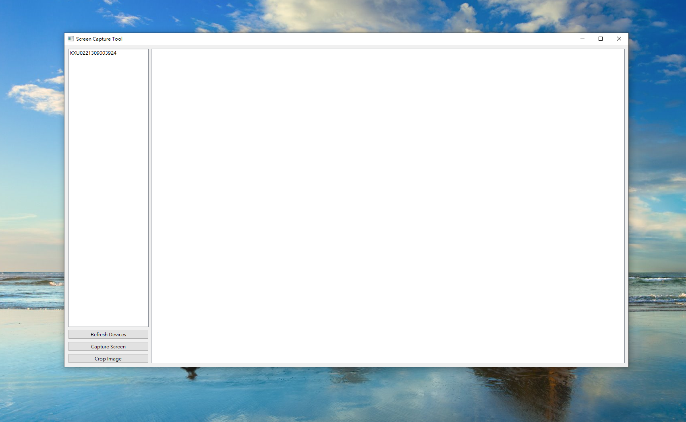

# Android Screen Capture Tool

This is an Android screen capture tool developed using PyQt6 and the adb tool. This tool allows you to connect to Android devices, capture screen screenshots, and crop them within a graphical user interface.

## Features



- Automatically detect connected Android devices
- Capture screen screenshots of Android devices
- Display screenshots within the application
- Select cropping area with the mouse and save as a new file
- Resize screenshots to fit the user interface
- Support for multiple Android devices

## Installation

1. Ensure you have Python 3.6 or higher installed. You can download it from the [Python official website](https://www.python.org/downloads/).

2. Install PyQt6. Run the following command in your terminal:

 ```bash
 pip install PyQt6
 ```
3. Ensure you have the Android Debug Bridge (adb) tool installed. You can find instructions on how to install and use adb on the [Android Developers website](https://developer.android.com/studio/command-line/adb).

## Usage

1. Connect your Android device to your computer.

2. Enable USB debugging mode on your Android device. More information can be found on the [Android Developers website](https://developer.android.com/studio/debug/dev-options).

3. Run the screen capture tool. Execute the following command in your terminal:

 ```bash
 python main.py
 ```

4. In the application, click the "Refresh Devices" button to display the connected Android devices.

5. Select the device you want to capture the screen from, and click the "Capture Screen" button.

6. On the displayed screenshot, use the mouse to select the area you want to crop.

7. Click the "Crop Image" button to crop the selected area and save it as a new file.

## License

This project is licensed under the [MIT License](https://opensource.org/licenses/MIT).

Feel free to modify, distribute, and use this screen capture tool. If you have any questions, please don't hesitate to ask.